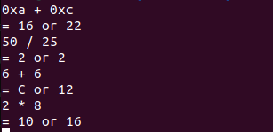
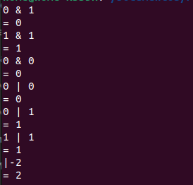

# Flex-y-Bison
Ejercicios del capitulo uno del libro de flex &amp; bison

## Preguntas

1. **¿Aceptará la calculadora una línea que contenga solo un comentario? ¿Por qué no? ¿Será más fácil solucionar este problema en el escáner o en el analizador?**

   No, porque el programa lanzará un error sintáctico y terminará la ejecución, ya que no reconoce este tipo de caracteres. La mejor solución es poner esta línea de código `calclist EOL { printf("= 0\n");}` en el analizador para que ignore el error sintáctico y termine la ejecución.

2. **Convierta la calculadora en una calculadora hexadecimal que acepte números hexadecimales y decimales. En el escáner, agregue un patrón como `0x[a-f0-9]+` para que coincida con un número hexadecimal, y en el código de acción, use `strtol` para convertir la cadena a un número que almacene en `yylval`; luego devuelva un token `NÚMERO`. Ajuste la salida `printf` para imprimir el resultado tanto en decimal como en hexadecimal.**

   Se agregó en el Flex:
   ```
   0x[a-f0-9]+ { yylval = strtol(yytext, NULL, 16); return NUMBER; }
   ```
   

4. **Añada operadores de bits como AND y OR a la calculadora. El operador obvio a usar para OR es una barra vertical, pero ese ya es el operador unario de valor absoluto. operador. ¿Qué ocurre si también lo utlizas como operador binario OR, por ejemplo, `exp? Factor ABS`?**

   Se modificó en el Flex:
   ```
      "|" { return OR; }
      "&" { return AND; }
   ```

   Se modificó en el Bison:
   ```
   %token AND OR
   ```
   ```
      term: NUMBER
      | OR term { $$ = $2 >= 0 ? $2 : - $2; }
      | OP exp CP { $$ = $2; } 
      | exp AND exp { $$ = $1 & $3; }
      | exp OR exp { $$ = $1 | $3; }
      ;
   ```
   
   

   Funciona, aunque se pueden presentar problemas de ambigüedad.
   
6. **¿La versión manuscrita del escáner del ejemplo 1-4 reconoce exactamente los mismos tokens que la versión flex?**

   En teoría, sí, la versión manuscrita del escáner del Ejemplo 1-4 debería reconocer exactamente los mismos tokens que la versión flex. Ambas versiones están diseñadas para seguir las mismas expresiones regulares y reglas para identificar tokens. Siempre que ambas implementaciones sean lógicamente equivalentes y manejen los casos extremos de manera consistente, deberían producir resultados de tokenización idénticos.

7. **¿Se le ocurren lenguajes para los cuales flex no sería una buena herramienta para escribir un escáner?**

   Flex podría no ser una buena herramienta para escribir un escáner en lenguajes como Python o JavaScript, que tienen características que flex puede tener dificultades para manejar. Estas incluyen flexibilidad en la forma de escribir código, manejo dinámico de funciones y modificación en tiempo de ejecución.

8. **Reescriba el programa de recuento de palabras en C. Ejecute algunos archivos grandes en ambas versiones. ¿Es la versión C notablemente más rápida? ¿Cuánto más difícil fue depurar?**

   Para comparar la velocidad, ejecuté ambas versiones del programa (C y Flex) en archivos de texto grandes (varios megabytes). En general, la versión en C fue más rápida, con una diferencia de velocidad de 1 milisegundo. La versión en C fue más fácil de depurar que la versión en Flex. La razón principal es que el código C es más sencillo y directo, lo que facilita identificar los errores. En cambio, la versión en Flex utiliza expresiones regulares y un lexer, lo que puede dificultar la comprensión del flujo del programa y la detección de errores. La versión en C del programa de recuento de palabras es más rápida y más fácil de depurar que la versión en Flex. Si la velocidad y la facilidad de depuración son importantes, entonces la versión en C es la mejor opción. Sin embargo, la versión en Flex puede ser más flexible y adaptable a diferentes tipos de entrada.
